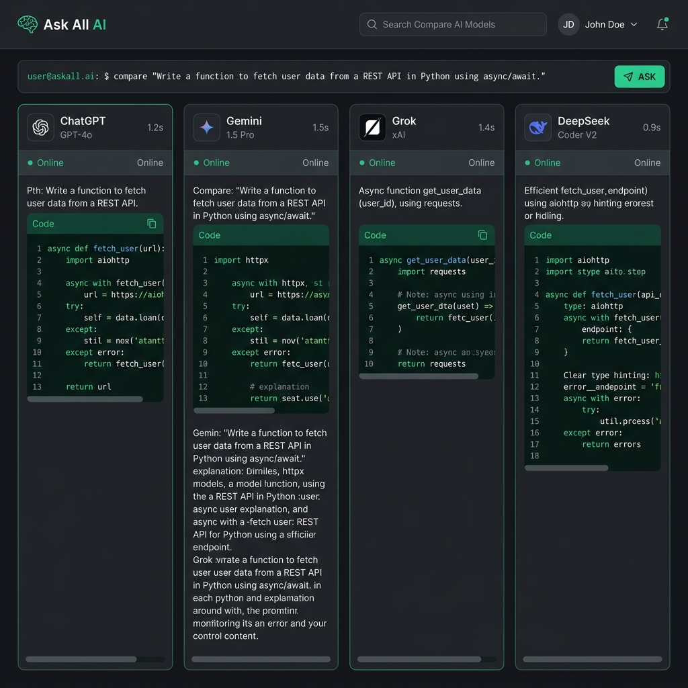

# Ask All AI

`Ask All AI` 是一个基于本地 Web 的大模型对比客户端。它为命令行工具 [`@jackwener/opencli`](https://github.com/jackwener/opencli) 提供可视化界面，支持并发向 ChatGPT、Gemini、Grok 和 DeepSeek 提问并流式对比结果。

### 🔗 相关链接
- **GitHub 仓库**: [github.com/holynova/ask_all_ai](https://github.com/holynova/ask_all_ai)
- **GitHub Pages 预览**: [holynova.github.io/ask_all_ai](https://holynova.github.io/ask_all_ai/)

### 📸 项目截图

